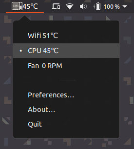

# Hardware Sensors Indicator (indicator-sensors)

Application indicator to display and monitor the readings
from various hardware sensors (temperature, fan speeds, voltages
etc) in the desktop panel for GNOME / Ubuntu

## Installation

### Snapcraft Store

The preferred way to install `indicator-sensors` is via the [snapcraft
store](https://snapcraft.io/indicator-sensors).

First ensure you have [snap support in your desktop
install](https://docs.snapcraft.io/core/install)

Then you can just <kbd>sudo snap install indicator-sensors</kbd> to install
from the command line.

## License

Copyright © 2018 Alex Murray

Distributed under GNU GPL, version 3.
